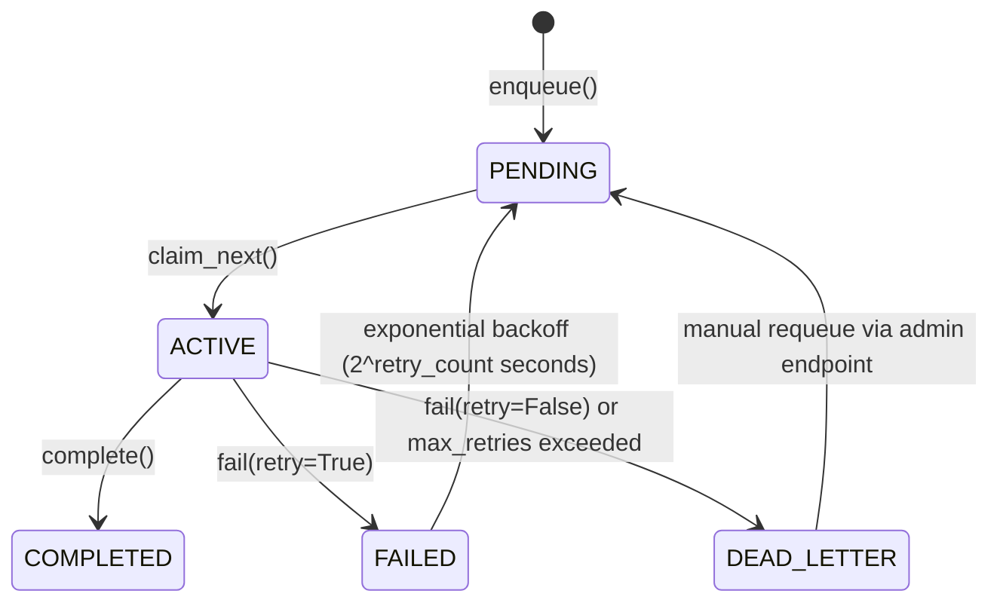

# Distributed Task & Event System

This document describes the distributed architecture of the task queue and event bus, focusing on scaling, leader election, deployment modes, and operational concerns.

> **Implementation details:** see the [task system README](../packages/core/src/dynastore/models/README.md) and the [Tasks module README](../packages/core/src/dynastore/modules/tasks/README.md).

## Design Goals

- Scale to millions of users, millions of collections, and hundreds of thousands of catalogs
- Support deployments with many concurrent service instances
- Minimize idle database connections (avoid N instances x LISTEN)
- Exactly-once task delivery without thundering herd
- Automatic event consumption without configuration

## Architecture Overview

```
┌──────────────────────────────────────────────────────────┐
│                   PostgreSQL                             │
│  ┌──────────────────┐  ┌──────────────────────────────┐  │
│  │   tasks.tasks     │  │       tasks.events           │  │
│  │  (RANGE monthly)  │  │      (RANGE monthly)         │  │
│  └──────┬───────────┘  └──────────┬───────────────────┘  │
│         │ pg_notify                │ pg_notify            │
│         │ 'new_task_queued'        │ 'dynastore_events'   │
└─────────┼──────────────────────────┼─────────────────────┘
          │                          │
    ┌─────┴──────────────────────────┴─────┐
    │         Leader Instance              │
    │   (won pg_try_advisory_lock)         │
    │   LISTEN on both channels            │
    │   → emit signal_bus events           │
    └─────────────┬────────────────────────┘
                  │ signal_bus
    ┌─────────────┴────────────────────────┐
    │       All Instances (including       │
    │       leader)                        │
    │  ┌──────────┐  ┌──────────────────┐  │
    │  │Dispatcher│  │ Event Consumer   │  │
    │  │claim_next│  │ consume_batch    │  │
    │  │SKIP LOCK │  │ SKIP LOCKED     │  │
    │  └──────────┘  └──────────────────┘  │
    └──────────────────────────────────────┘
```

## Leader Election

### Problem
Many instances each holding a persistent `LISTEN` connection = too many idle database connections.

### Solution: One Leader Per Service Type

Each service type (identified by the `NAME` env var) elects exactly one LISTEN leader via `pg_try_advisory_lock`:

```python
lock_key = hash(f"dynastore.queue_listener.{NAME}") & 0x7FFFFFFFFFFFFFFF
lock_acquired = await conn.fetchval("SELECT pg_try_advisory_lock($1)", lock_key)
```

- **Leader:** Holds LISTEN on `new_task_queued`, `task_status_changed`, and `dynastore_events_channel`. Filters incoming notifications against the `CapabilityMap` before emitting signal_bus events.
- **Follower:** Emits a periodic signal_bus event every `poll_interval` seconds to trigger claim sweeps.
- **Failover:** On leader death, the session-level advisory lock is released automatically. The next follower to reconnect wins the election.

**Connection budget:** one LISTEN connection per service type, not one per instance.

## Runner-Aware Task Claiming

### Capability Map

At startup, a `CapabilityMap` singleton is built by querying each runner's `can_handle()` method:

```python
class CapabilityMap:
    async def refresh(self):
        for task_type in get_loaded_task_types():
            for runner in get_runners(ASYNCHRONOUS):
                if runner.can_handle(task_type):
                    self._async_types.add(task_type)
                    break
            for runner in get_runners(SYNCHRONOUS):
                if runner.can_handle(task_type):
                    self._sync_types.add(task_type)
                    break
```

### Runner Priority Chain

| Runner | Priority | `can_handle()` | Mode |
|---|---|---|---|
| `CloudJobRunner` | 10 | `task_type in self._job_map_cache` | ASYNC |
| `BackgroundRunner` | 100 | `get_task_instance(task_type) is not None` | ASYNC |
| `SyncRunner` | 100 | `get_task_instance(task_type) is not None` | SYNC |

Deployments without a cloud job runner (e.g. on-premise) fall through to `BackgroundRunner` transparently.

### Claim Query

The dispatcher's `claim_next()` query filters by the capability map types so each service only claims tasks it can actually execute:

```sql
WHERE status = 'PENDING'
  AND (locked_until IS NULL OR locked_until <= NOW())
  AND (
      (execution_mode = 'ASYNCHRONOUS' AND task_type = ANY(:async_types))
      OR
      (execution_mode = 'SYNCHRONOUS' AND task_type = ANY(:sync_types))
  )
ORDER BY timestamp ASC LIMIT 1
FOR UPDATE SKIP LOCKED
```

## Batched Heartbeat

A single `BatchedHeartbeat` coroutine fires one `UPDATE ... WHERE task_id = ANY(...)` per 30-second interval across all owned tasks, replacing per-task heartbeat transactions.

The visibility timeout (default: 5 minutes) determines how long a task stays claimed. If a worker dies without completing or heartbeating, the Janitor reclaims the task after the timeout expires.

## Janitor

The Janitor runs on each dispatcher wakeup cycle (throttled to once per ~17 seconds). It uses `pg_try_advisory_xact_lock` to elect a single Janitor leader across all instances.

1. **Stale task recovery:** Finds `ACTIVE` tasks with expired `locked_until` (dead workers). If `retry_count < max_retries`, resets to `PENDING` with exponential backoff. Otherwise moves to `DEAD_LETTER`.
2. **Orphan cleanup:** Dead-letters tasks whose `schema_name` no longer exists in `catalog.catalogs`.

## Automatic Event Consumer

The event consumer starts **automatically** when any module registers async event listeners. No environment variable (`DYNASTORE_ENABLE_EVENT_CONSUMER`) is needed — modules opt in declaratively by registering listeners.

After all modules initialize:
```python
if self.event_service.has_listeners():
    await self.event_service.start_consumer(shutdown_event)
```

Multiple instances shipping the same module both start consumers. `FOR UPDATE SKIP LOCKED` on the events outbox ensures only one processes each event.

### Deduplication

When an event handler creates a task, it includes:
```python
dedup_key = f"evt:{event_id}:{task_type}"
```

The UNIQUE partial index on `dedup_key` in `tasks.tasks` prevents duplicate tasks even if two instances race on the same event.

## Deployment Modes

| Environment | Notification | Event Consumer | Available Runners |
|---|---|---|---|
| **On-premise (docker-compose)** | Leader/follower pg_notify | Automatic | SyncRunner, BackgroundRunner |
| **Cloud service (multi-instance)** | Leader/follower pg_notify | Automatic | SyncRunner, BackgroundRunner, CloudJobRunner |
| **Cloud one-shot job** | N/A (one-shot) | N/A | Direct execution via `main_task.py` |

### One-shot job entrypoint

`main_task.py` is a generic worker that boots up, initializes modules, and runs a single task:

```bash
python -m dynastore.main_task ingestion '{"task_id": "...", "inputs": {...}}' --schema s_abc123
```

The `--schema` argument maps to the `schema_name` column value in the global `tasks.tasks` table.

## Module Startup Order

Task infrastructure must be ready before other modules that depend on it:

| Module | Priority | Notes |
|---|---|---|
| `DatabaseModule` | 5 | Connection pools |
| `TasksModule` | 15 | Creates `tasks.tasks` and `tasks.events` tables |
| `CatalogModule` | 20 | Starts event consumer (needs events table to exist) |

## Failure & Retry



## Data Lifecycle

| Data | Default Retention | Mechanism |
|---|---|---|
| COMPLETED tasks | 30 days | Monthly partition DROP |
| FAILED tasks | 30 days | Monthly partition DROP |
| DEAD_LETTER tasks | 90 days | Separate retention window |
| PENDING/ACTIVE (stale) | visibility_timeout | Janitor requeues or dead-letters |
| Consumed events | Immediate | DELETE after processing |
| Dead letter events | 30 days | Maintenance supervisor cleanup |

### Partition Lifecycle

Partitions are managed by complementary mechanisms to ensure zero-downtime operation:

1. **Startup** (`ensure_future_partitions`): Creates partitions 12 months ahead on every application restart.
2. **Maintenance supervisor** (leader-elected, runs in-process): Creates future partitions monthly and drops expired partitions on a weekly schedule. This is the safety net for services running continuously without restarts. Orphan partition-maintenance entries for deleted tenant schemas are also reaped here.

Both creation and deletion are non-blocking: `CREATE TABLE IF NOT EXISTS` is metadata-only DDL; `DROP TABLE` locks only the specific child partition being removed.

## Key Source Files

| File | Responsibility |
|---|---|
| `src/dynastore/modules/tasks/tasks_module.py` | DDL, CRUD, TaskQueueProtocol implementation |
| `src/dynastore/modules/tasks/dispatcher.py` | Claim loop, janitor, heartbeat |
| `src/dynastore/modules/tasks/queue.py` | Leader/follower LISTEN, signal_bus |
| `src/dynastore/modules/tasks/runners.py` | `can_handle()`, CapabilityMap |
| `src/dynastore/modules/tasks/maintenance.py` | Admin tools (stats, purge, dead-letter management) |
| `src/dynastore/modules/catalog/event_service.py` | EventBusProtocol implementation, consumer |
| `src/dynastore/main_task.py` | One-shot job generic entrypoint |
| `src/dynastore/models/protocols/task_queue.py` | TaskQueueProtocol definition |
| `src/dynastore/models/protocols/event_bus.py` | EventBusProtocol definition |
